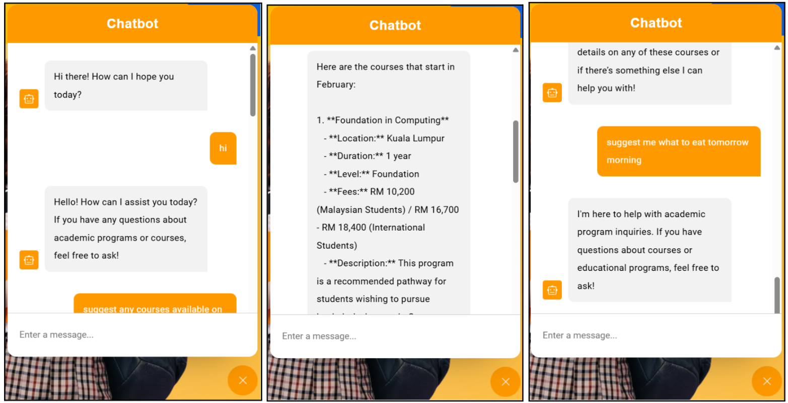
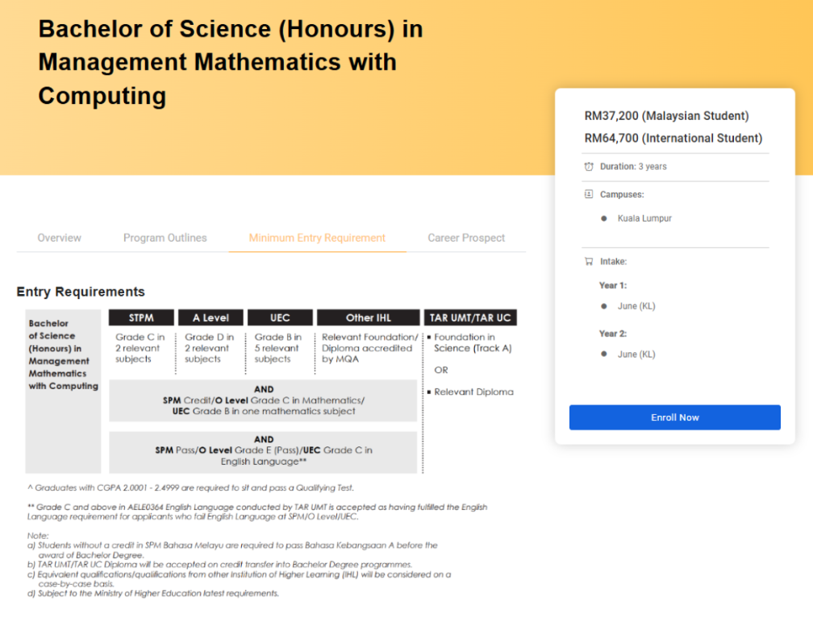
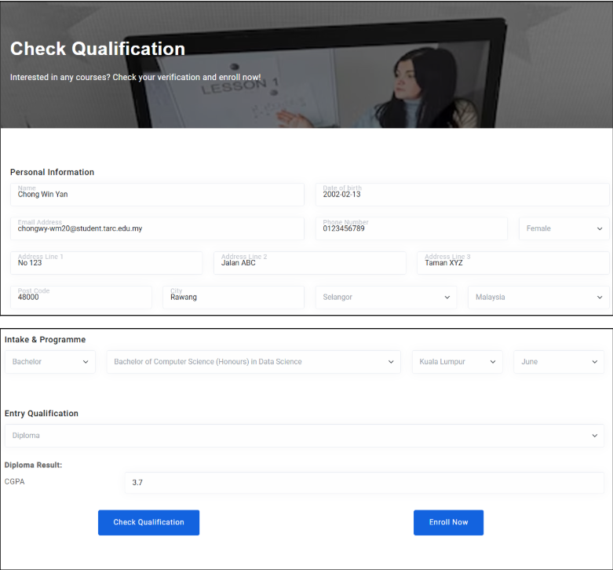
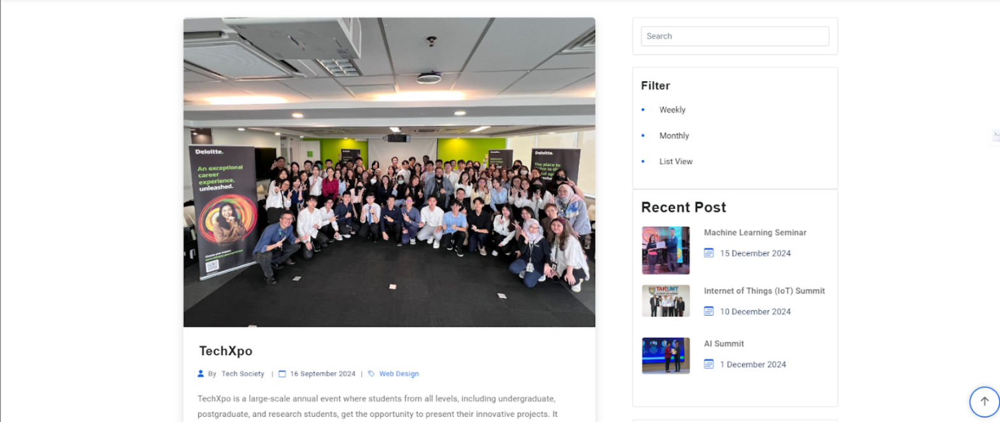

# TARUMT Website Enhancement
This repository contains the source code and documentation for the TARUMT Website Enhancement project. The project focuses on improving the user experience, functionality, and design of the TARUMT website to better serve its users and stakeholders.  

## Project Overview  
- Objective: Enhance the existing TARUMT website by introducing modern features, improving accessibility, and optimizing the performance.  
## Key Features:  
- Integration with API for AI Chatbot in assisting user's academic related queries  
- Qualification checking for field of study  
- Event enrollment registration  
  
## Technologies Used    
- Frontend: HTML5, CSS3, JavaScript, Bootstrap
- Backend: MySQL
- Tools: Git, Visual Studio Code

## Project Showcase
- AI Assistant

- Course details

- Qualification checking

- Event page & Registration
  

